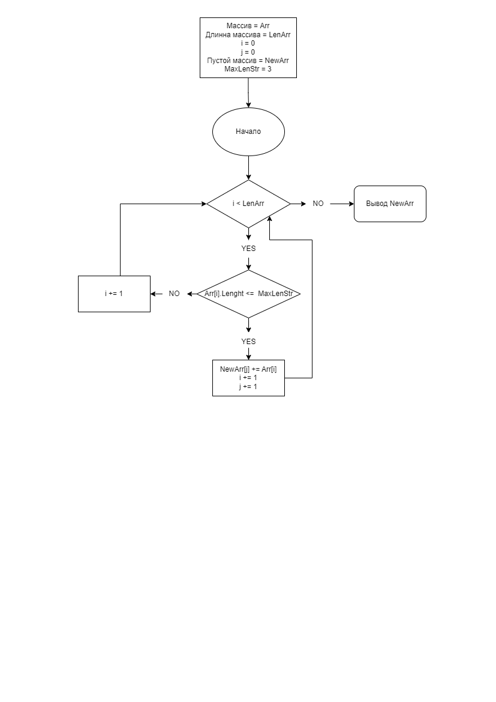

## Final-test-work
Программа из имеющегося массива строк формирует массив из строк, длина которых меньше "n" символов. 
В программе имеются настройки по умолчанию: 
*   длина строк при выборке равна менее 4, изменяется в коде через переменную "lenStr = 4". 
    Выбран способ "<" для сокращения количества операций и ускорения работы программы.
*   длина массива вводится через консоль, но есть и значение по умолчанию на случай неверного ввода, переменная "lenArr = 3".

Код состоит из 2х методов и вывода:
*   ReadArrayString - отвечает за ввод данных и формирование массива строк.
*   ArrayStringLenght - принимает на вход массив строк, за тем создаёт новый пустой массив строк. 
Выполняет перебор принятого массива выбирая строки по длинне менее заданной переменной "lenStr" и добавляет отобранные строки в созданный массив.
*   Вывод не оформнен в отдельный метод, а записан в 2 строки (1я информирует о проделанной операции и заданной длине строк, 2я выводит результат).

